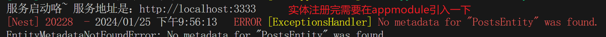

<!--
 * @Author: yeyu98
 * @Date: 2024-01-23 22:51:59
 * @LastEditors: yeyu98
 * @LastEditTime: 2024-01-25 22:09:35
 * @Description: 
-->
# problems
nest里模块指的是什么呢？
params /:id 要怎么获取到路径上的id呢？
query ?id=1 又要怎么设置且怎么获取呢？

# points

providers：服务提供者，在providers提供的服务可以被其他模块共享；
controllers：处理http请求，包括路由控制，向客户端返回响应，将具体业务逻辑委托给providers处理；
imports：导入模块的列表，从其他模块里导入一些其他模块的服务；
exports：导出模块列表，如果想要被其他模块使用当前模块的服务就可以在这里导出；

Controller：控制器一般用于设置路由，响应服务
@Controller：每个Controller都需要通过这个注解来标识以及使用控制器，通过传入路由路径来定义路由；


## HTTP方法处理装饰器
### HTTP方法装饰器
@Get()
```
  //  1.固定路径：
  // get 匹配路由 http://localhost:3000/app/list
  @Get('list')
  getList(): string {
    return "I'm get list";
  }
  // 2.通配符路径(?+* 三种通配符 )
  // 匹配路由 * http://localhost:3000/app/user_xxx
  @Get('user_*')
  getUser(): string {
    return 'getUser';
  }
```
@Post()
```
  // post 匹配路由 http://localhost:3000/app/list
  @Post('list')
  fetchList(): string {
    return "I'm post list";
  }
```
@Put()
```
  // 3.带参数路径
  @Put('/list/:id')
  update(): string {
    return 'update';
  }
```


### 路由路径

* 固定路径
* 通配符路径(?+* 三种通配符 )
* params 参数路径：当params参数路由先定义时如果还有相同的方法以及路由会优先匹配 params参数路由已经满足了就不会往下再匹配了（路由匹配是至上而下的先定义先匹配）

### 全局路由前缀
可以在main.ts文件中通过app.setGlobalPrefix('api')添加；

### nest cli命令
nest g [文件类型] [文件名]
创建顺序Module --> Controller --> Service

### 数据库操作
#### 建表相关装饰器
@Entity：标识当前类是一个实体；
@Column：定义列的数据类型；
@PrimaryGeneratedColumn 设置某一列为主键并自动生成，有几种生成id的方式increment（自增）、uuid（随机生成唯一标识）、rowid、identity；


##### Entity
实体定义完使用的时候需要在当前module中引入：
```
@Module({
  imports: [TypeOrmModule.forFeature([PostsEntity])],
  controllers: [PostsController],
  providers: [PostsService],
})
```
在appModule中也需要引入一下实体否则会报以下错误：

```
imports: [
  // 数据库连接配置这里目前不太理解为什么这么做
  ConfigModule.forRoot({
    isGlobal: true,
    envFilePath: [envConfig.path],
  }),
  TypeOrmModule.forRootAsync({
    imports: [ConfigModule],
    inject: [ConfigService],
    useFactory: async (configService: ConfigService) => ({
      type: 'mysql', // 数据库类型
      entities: [PostsEntity], // 数据表实体
      ...
    }),
  }),
]
```


实体设置的三种方式（在创建完实体之后就需要在数据库里设置一下）
- 单独定义：就是每次手动的往 entities: [PostsEntity] 这个数据里添加；
  ```
  TypeOrmModule.forRoot({
    //...
    entities: [PostsEntity, UserEntity],
  }),
  ```
- 自动引入：就是每次创建了实体之后就会自动往entities数组中添加
  ```
  TypeOrmModule.forRoot({
    //...
    autoLoadEntities: true,
  }),
  ```
- 配置路径自动引入：就是根据路径自动匹配加载对应的实体
  
  ```
   TypeOrmModule.forRoot({
    //...
    entities: ['dist/**/*.entity{.ts,.js}'],
  }),
  ```